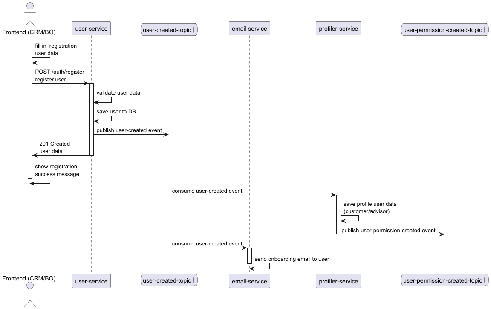

# User Registration Process

## Purpose
Describe the end-to-end flow for registering a new user, from the Frontend interaction to the onboarding email dispatch,
as represented in the associated UML sequence diagram. 
The flow also includes synchronous role/permission provisioning via profiler-service and password generation/encoding within user-service.

Diagram: [User Registration Sequence Diagram](../../../assets/registration/user-registration/user-registration-process-diagram.png)

## Context and Motivation
The process separates synchronous user creation from asynchronous post-creation activities (email and future consumers)
through publication of a user-created domain event on a dedicated topic, enabling decoupling and scalability.
In addition, immediately after persisting the user, user-service coordinates with profiler-service to assign baseline 
roles/permissions required for subsequent authentication/authorization flows, while ensuring passwords are generated and stored only in encoded form.

## Actors / Components
- Frontend (CRM/BO): User interface used by an operator to input user data.
- user-service: Validates and persists the new user;
generates and encodes a temporary/initial password;
assigns baseline roles/permissions by calling profiler-service;
emits the domain event.
- user-created-topic: Messaging topic/queue for asynchronous propagation.
- email-service (Reporting): Consumer of the event; sends onboarding email (e.g., set-password link or initial credentials) in an asynchronous, idempotent way.
- profiler-service: Manages permission assignment and aggregation (roles → feature/permission set); 
receives a synchronous request from user-service at registration time to provision the user's roles/permissions
(e.g., CUSTOMER or ADVISOR per bankCode as applicable).
- bank-service: Provides authoritative validation of supplied bankCode / branch identifiers during registration;
exposes metadata (e.g., bank status) required to complete user association; may reject registration if bank is inactive or code invalid.

## Detailed Documentation

### 1. High-Level Narrative
The operator gathers the user data and submits a creation request.
The user-service performs authoritative validation and generates an initial password, which is encoded (non-reversible) before storage.
The user entity is persisted in a single transaction. Immediately after successful persistence, user-service performs a synchronous call
to profiler-service to provision baseline roles/permissions for the new user (per bankCode when applicable). 
After the transaction commits, user-service publishes a lightweight domain event.
Downstream, the email-service consumes this event and delivers an onboarding email asynchronously 
(e.g., including a set-password action or initial one-time credentials), ensuring the creation latency is not inflated by external side effects.

### 2. Responsibilities
- Frontend: Input collection, basic validation, correlation propagation.
- user-service: Validation authority, password generation and encoding, transactional safety, synchronous permission provisioning via profiler-service, event emission guarantee (publish-after-commit).
- user-created-topic: Reliable distribution (durable, ordered per key if required).
- email-service: Idempotent consumption, reliable email dispatch, observability of retries; does not perform persistence or permission decisions.
- profiler-service: Owns permission taxonomy & assignment; translates roles + bank/branch codes into persisted feature/permission tuples; exposes synchronous APIs invoked by user-service at registration time.
- bank-service: Validates bank/branch codes, ensures bank is active, supplies necessary bank metadata for user association,
contributes to rejection path if invalid/inactive.
