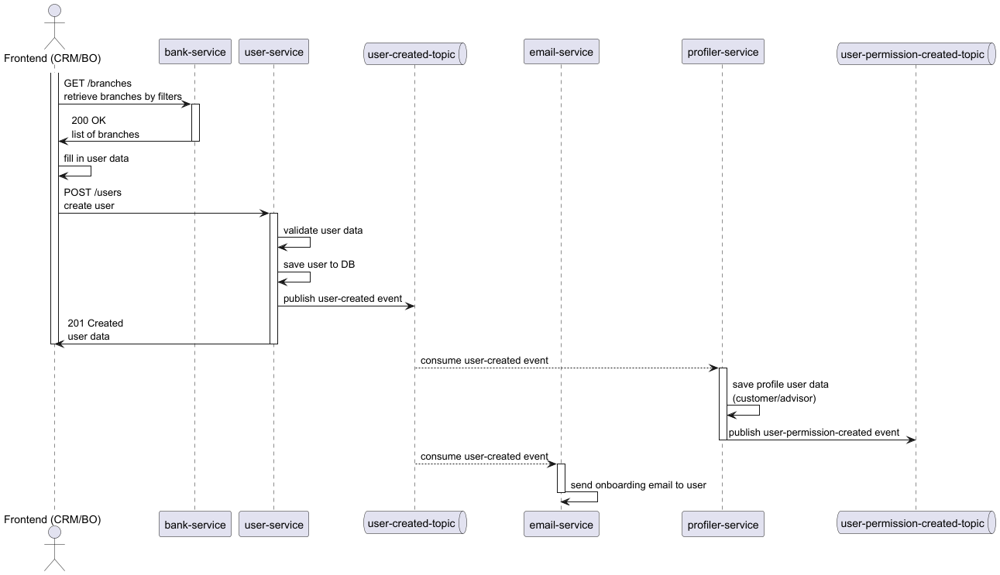

# User Registration Process

## Purpose
Describe the end-to-end flow for registering a new user, from the Frontend interaction to the onboarding email dispatch, as represented in the associated UML sequence diagram.

Diagram: [User Registration Sequence Diagram](../../../assets/registration/user-registration/customer-registration/customer-registration-process-diagram.png)



## Context and Motivation
The process separates synchronous user creation from asynchronous post-creation activities (email and future consumers) through publication of a user-created domain event on a dedicated topic, enabling decoupling and scalability.

## Actors / Components
- Frontend (CRM/BO): User interface used by an operator to input user data.
- bank-service: Provides the (filterable) list of branches (reference data).
- user-service: Validates and persists the new user; emits the domain event.
- user-created-topic: Messaging topic/queue for asynchronous propagation.
- email-service (Reporting): Consumer of the event; sends onboarding email.
- profiler-service: Manages permission assignment and aggregation (roles → feature/permission set).

---
## Extended Detailed Documentation

### 1. High-Level Narrative
The operator gathers the branch context, inputs mandatory identification data, and submits a creation request. The user-service performs authoritative validation, persists the entity in a single transaction, and (only after commit) publishes a lightweight domain event. Downstream, the email-service consumes this event and delivers an onboarding email asynchronously, ensuring the creation latency is not inflated by external side effects.

### 2. Sequence Breakdown (UML Alignment)
| # | Interaction | Purpose | Sync? | Notes |
|---|-------------|---------|-------|-------|
| 1 | Frontend -> bank-service (GET /branches) | Retrieve selectable branch references | Yes | Filters reduce payload size |
| 2 | bank-service -> Frontend (200) | Provide branch list | Yes | Empty list allowed (UI may block continue) |
| 3 | Frontend (local) | Operator fills form | Local | Client validation catches obvious errors |
| 4 | Frontend -> user-service (POST /users) | Submit creation payload | Yes | CorrelationId forwarded |
| 5 | user-service (validate) | Enforce domain & referential rules | Yes | Fail fast -> 400/409 |
| 6 | user-service (persist) | Transactional insert | Yes | Rollback on error |
| 7 | user-service -> topic (publish event) | Emit user-created | Boundary | After commit (outbox) |
| 8 | user-service -> Frontend (201) | Return created representation | Yes | Only after commit attempt |
| 9 | topic -> email-service | Deliver event | No | At-least-once semantics |
|10 | email-service (compose) | Build onboarding content | No | Fetch template / localization |
|11 | email-service -> provider | Send email | No | Retries on transient failure |
|12 | topic -> profiler-service | Permission provisioning | No | Consumes user-created to derive permissions |

### 3. Responsibilities
- Frontend: Input collection, basic validation, correlation propagation.
- bank-service: Accurate, performant reference data exposure.
- user-service: Validation authority, transactional safety, event emission guarantee (publish-after-commit).
- user-created-topic: Reliable distribution (durable, ordered per key if required).
- email-service: Idempotent consumption, reliable email dispatch, observability of retries.
- profiler-service: Owns permission taxonomy & assignment; translates roles + branch codes into persisted feature/permission tuples; exposes query APIs.

---
## 4. Permission Integration & JWT Strategy

### 4.1 Are permissions needed inside the JWT?
Including raw, fine-grained permissions (feature/permission codes) inside the JWT is usually NOT recommended because:
- They can change frequently (permission revocation/addition) → long-lived tokens become stale.
- Payload bloat: nested section/feature/permission structures inflate token size, impacting headers and caches.
- Harder invalidation: every permission change would require immediate token refresh or revocation list.

Recommended approach: JWT contains only stable claims (userId, email, roles, branchCode, correlationId). Fine-grained permissions are resolved dynamically from the profiler-service using those base identifiers.

Optional extension: include a lightweight permission version or hash claim (e.g., `permVer` or `permHash`) allowing services to detect drift and request refresh if mismatched.

### 4.2 When to load permissions?
Two integration patterns:

1. Asynchronous (Recommended – Event Driven)
   - Flow: user-service publishes `user-created` → profiler-service consumes and persists permissions based on default role(s) & branch list.
   - JWT issued immediately without permissions (reduces registration latency).
   - First request to a permission-dependent endpoint triggers a read from profiler-service; optionally cache result (short TTL).
   - Permission changes later propagate via `user-permission-updated` events; services can evict caches.

2. Synchronous (On-demand at Registration/Login)
   - user-service calls profiler-service (REST) after user creation (or at login) to compute permissions.
   - Optionally packs a flattened list of permission codes into the JWT claim `perms`.
   - Increased latency & risk of stale tokens if permissions change post-issuance.

### 4.3 Recommended Flow (Event Driven)
Registration sequence delta:
| Step | Action |
|------|--------|
| A | user-service persists new user |
| B | user-service emits `user-created` (contains: userId, email, initial roles, branchCodes) |
| C | profiler-service consumes event, derives permissions via role sitemaps, persists tuples |
| D | client receives JWT without permissions but with roles & branchCode |
| E | On protected feature access, target service queries profiler-service using email + branchCode (from WMPContext) |
| F | Service caches UserPermission structure (e.g. 5–10 min, invalidate on update event) |

### 4.4 JWT Claims Set (Minimal)
Suggested stable claims:
```
{
  "sub": "<userId>",
  "email": "user@example.com",
  "roles": ["USER", "ADMIN"],
  "branchCode": "BR001",
  "permVer": 1,          // optional
  "iat": 1731086400,
  "exp": 1731090000,
  "iss": "user-service"
}
```

### 4.5 Authorization Evaluation
- For coarse-grained checks: use role-based annotations (`@PreAuthorize("hasRole('ADMIN')")`).
- For fine-grained feature/permission checks: implement a custom `AuthorizationManager` or method-level component that:
  1. Reads WMPContext (email, branchCode).
  2. Fetches (and caches) UserPermission from profiler-service.
  3. Verifies required permission code(s) are present.

### 4.6 Cache Strategy
- Local (per service) cache keyed by `email:branchCode`.
- TTL small (e.g., 5 min) or event-based eviction on `user-permission-updated`.
- Avoid distributing cache across services (each service caches only what it needs).

### 4.7 Token Refresh & Permission Changes
If permissions change materially (e.g., role upgrade):
- Option A: No immediate token refresh; backend sees new permissions via dynamic lookup.
- Option B: Increase `permVer` and prompt user to re-login if front-end requires UI adaptation pre-call.

### 4.8 Fallbacks & Error Handling
- If profiler-service unavailable: deny fine-grained actions (fail closed) or allow cached result if TTL not expired.
- If permissions missing (fresh user, async not completed yet): return a retriable error or an empty permission set and let UI poll.

### 4.9 Why Not Pack Permissions in JWT?
| Aspect | In JWT | Dynamic Lookup |
|--------|--------|----------------|
| Freshness | Stale until refresh | Always latest (cache TTL) |
| Size | Potentially large | Minimal token size |
| Revocation | Complex | Immediate via data change |
| Complexity | Simpler runtime | Slight runtime fetch + cache |

### 4.10 Outbox / Delivery Guarantees
To ensure permissions provisioning reliability, use outbox pattern for `user-created` emission. Profiler-service should be idempotent (ignore duplicates) and emit `user-permission-updated` events on changes for cache eviction.

---
## 5. Implementation Tasks (Next Steps)
1. Confirm `user-created` event schema includes required fields (userId, email, roles, branchCodes).
2. Add consumer in profiler-service (if missing) for `user-created` -> call `saveUserPermissions` with derived role list.
3. Define REST endpoint in profiler-service: `GET /permissions/current` returning `UserPermissionDTO`.
4. Implement permission cache & custom AuthorizationManager in services needing fine-grained checks.
5. Optionally add `permVer` claim and expose a `GET /permissions/version` endpoint.
6. Document error responses when permissions are not yet provisioned.

---
## 6. Open Questions
- Do we need a UI immediate reflection of permissions post-registration? If yes, consider synchronous wait or polling.
- Token lifetime vs permission volatility: short-lived (e.g., 15 min) tokens make stale role risk low.
- Auditing: Should permission evaluations log decision + source (cache vs remote)?

---
## 7. Summary
Use minimal JWT (no embedded permissions). Provision permissions asynchronously via profiler-service consuming `user-created` events. Resolve permissions dynamically with cached lookups for fine-grained authorization, enabling flexibility, reduced token size, and easier revocation.
